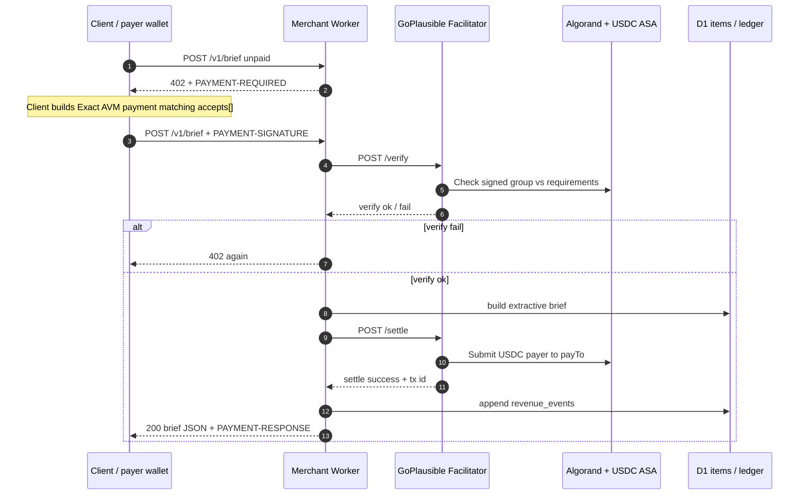
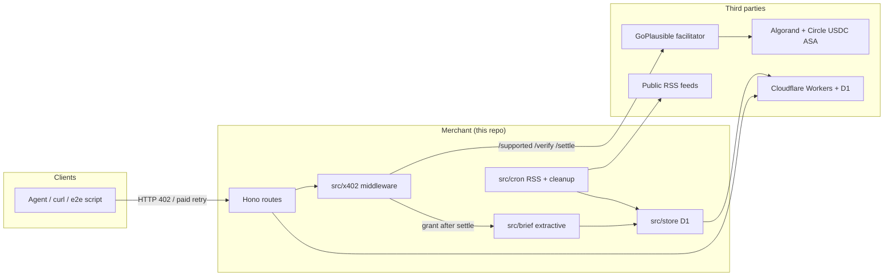

# x402 control flow — x402-agent-api

How this repo implements Algorand x402 (Exact AVM) with GoPlausible, and what is trusted by whom.

## Actors

| Actor | What it is here | Trust role |
|-------|-----------------|------------|
| **Client / payer** | Agent or `pnpm e2e:pay-brief` using payer wallet | Signs USDC payment; loses funds if it pays a malicious `payTo` |
| **Resource server (merchant)** | This Worker (`apps/api`) on localhost or Cloudflare | Declares price/`payTo`; decides when to fulfill after verify/settle |
| **Facilitator** | `https://facilitator.goplausible.xyz` | Verifies payload vs requirements; submits/settles on-chain; fee-payer on AVM groups |
| **Algorand Testnet/Mainnet** | Public chain + USDC ASA | Source of truth for balances and settlement |
| **D1** | Cloudflare SQLite (items + ledger) | Merchant-private store; not part of payment trust |
| **Feeds / Circle faucet** | RSS sources; Testnet USDC faucet | Ops only; not on the payment critical path |

GoPlausible is **permissionless for verify/settle**: no merchant signup, API key, or domain allowlist is required for the Worker to call `/verify` and `/settle`. Discovery/bazaar indexing (if used later) is a separate concern from settlement trust.

---

## Sequence (paid `POST /v1/brief`)



Unpaid local smoke can short-circuit with Testnet-only `x-dev-bypass` (never on Mainnet). That path does **not** talk to the facilitator.

---

## Component view



---

## What the facilitator actually checks

On `/verify` and `/settle`, GoPlausible cares about the **payment object**, not about whether your hostname is “approved”:

1. **Scheme + network** match a supported Exact AVM kind (CAIP-2 + `exact`).
2. **Signed Algorand transaction group** is well-formed (amounts, asset ASA id, receiver = `payTo`, timeouts, optional fee-payer leg).
3. **Requirements** the merchant sent in the verify/settle body match what the client signed against (so the merchant cannot silently change price after the client signed).
4. On settle: broadcast/confirm on-chain; return tx id.

It does **not**:

- Call back to `http://127.0.0.1:8787` or your `*.workers.dev` URL to “validate the site”.
- Require HTTPS on the merchant for settlement to work (local HTTP works; production should still be HTTPS for clients).
- Hold USDC (non-custodial relative to merchant/payer balances).

So: **trust in the facilitator is cryptographic + on-chain**, not URL/domain allowlisting.

---

## How trust is established (who trusts what)

### 1. Client → Merchant

- Client trusts the **HTTP endpoint it chose** to return honest `PAYMENT-REQUIRED` (`payTo`, price, asset).
- Protection: TLS (in prod) reduces MitM on the 402 header; the client should still verify `payTo` / amount before signing (agents: pin known merchants).
- Paying the wrong `payTo` is irreversible once settled.

### 2. Merchant → Facilitator

- Merchant trusts GoPlausible’s HTTPS API (`FACILITATOR_URL`) to correctly verify and settle.
- Merchant authenticates to the facilitator **by speaking the public HTTP API** (no API key in this setup). Anyone can call `/verify`/`/settle` with a valid payload.
- Merchant must use HTTPS to the facilitator so MitM cannot forge verify/settle responses (Workers/`fetch` to `https://facilitator.goplausible.xyz`).

### 3. Facilitator → Merchant URL

- **Does not need to trust or reach your URL** for verify/settle.
- The `resource.url` inside `PAYMENT-REQUIRED` is **metadata for clients/discovery** (what was paid for). Settlement validity is independent of that string being publicly reachable.
- That is why **local `http://127.0.0.1:8787` E2E works**: the Worker initiates outbound calls *to* the facilitator; the facilitator never needs inbound access to localhost.

### 4. Facilitator / chain → Wallets

- **Payer** must sign; **merchant `PAY_TO`** must be opted into USDC ASA or receive fails.
- GoPlausible may appear as **feePayer** in `extra` / supported kinds so groups can be fee-abstracted; that is chain-level cooperation, not merchant domain trust.

### 5. Challenge / discovery tag

- `extra.tag = x402-global-challenge` is an application/contest signal for indexing and dashboards.
- It is **not** what authorizes settle. Listing in a bazaar may later involve crawling `https://…` endpoints; that is discovery reputation, separate from payment validity.

### 6. Cloudflare deployment

| Layer | What it proves |
|-------|----------------|
| `*.workers.dev` HTTPS | Cloudflare terminates TLS for that hostname; clients get transport integrity to *that* Worker |
| Custom domain (`x402.darkhold.dev`) | Same + DNS you control; still not a facilitator allowlist |
| Wrangler `account_id` | Which CF account owns the Worker/D1 — infra auth, unrelated to x402 settle |
| D1 binding | Merchant data plane only |

Facilitator still only sees: HTTPS requests from the Worker’s egress with payment payloads.

---

## Local vs deployed (same protocol)

```text
Local:   Client ──HTTP──► wrangler dev :8787 ──HTTPS──► GoPlausible ──► Algorand Testnet
Deploy:  Client ──HTTPS─► *.workers.dev     ──HTTPS──► GoPlausible ──► Algorand Testnet
```

Differences that matter:

- **TLS to merchant**: recommended in prod for clients; not required for facilitator settle.
- **Secrets**: `PAY_TO`, `INGEST_TOKEN` via `.dev.vars` locally / `wrangler secret` remotely. Never commit.
- **`DEV_BYPASS_SECRET`**: Testnet/local unpaid shortcut only; must be unset on Mainnet.
- **Network env**: `dev` → Testnet CAIP-2 + USDC `10458941`; `prod` → Mainnet + `31566704` on `x402.darkhold.dev` only.

---

## Data after a successful pay

1. USDC moves **payer → `PAY_TO`** on Algorand (facilitator-reported tx id).
2. Worker writes `revenue_events` (and extractive `cost_events`) in D1.
3. Response body is the morning-brief product; payment proof may also appear in settlement response headers.

Replay / double-fulfill: D1 `payment_claims` UNIQUE on sha256(`payment-signature` / `x-payment`). Replay → **409** before brief build. Key is the payment header hash because `@x402/hono` settles *after* the handler (settle tx id is not available yet). Facilitator settle remains the money gate; D1 ledger is the metering mirror.

---

## Ops pointers

- Wallet / opt-in / E2E: [scripts/README.md](./scripts/README.md)
- Progress checklist: [PROGRESS.md](./PROGRESS.md)
- Facilitator concept (upstream): [GoPlausible facilitator docs](https://github.com/GoPlausible/x402-avm/blob/main/docs/core-concepts/facilitator.md)
